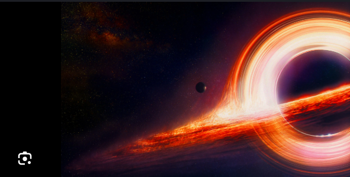

<div align="center">

# Kerr Black Hole Simulation

### A Scientifically Accurate 3D Visualization of Rotating Black Holes

[](https://opensource.org/licenses/MIT)
[](https://www.khronos.org/webgl/)
[](#validation)
[](https://developer.mozilla.org/en-US/docs/Web/JavaScript)

*Real-time ray marching through curved spacetime using pure WebGL*



[Live Demo](#quick-start) | [Documentation](#physics-background) | [Educational Tour](#educational-tour) | [Contributing](#contributing)

</div>

---

## Overview

This project simulates the appearance of a **rotating (Kerr) black hole** with physically accurate rendering including:

- **Gravitational Lensing** - Background starlight bent around curved spacetime
- **Accretion Disk** - Relativistic Doppler shifting and beaming effects
- **Black Hole Shadow** - Validated against Event Horizon Telescope observations
- **Photon Sphere** - Unstable circular photon orbits
- **Ergosphere** - Frame-dragging visualization
- **Relativistic Jets** - Blandford-Znajek mechanism with Doppler boosting

<div align="center">

| Schwarzschild (a=0) | High Spin (a=0.9M) | Extremal (a=0.998M) |
|:---:|:---:|:---:|
| Non-rotating | Moderate rotation | Maximum rotation |
| r₊ = 2M | r₊ = 1.44M | r₊ ≈ M |

</div>

---

## Quick Start

### Prerequisites

- Modern web browser with **WebGL 2.0** support (Chrome, Firefox, Safari, Edge)
- Local web server for ES6 module imports

### Installation

```bash
# Clone the repository
git clone https://github.com/Emp1500/kerr-black-hole-simulation.git
cd kerr-black-hole-simulation

# Start a local server (choose one)
python -m http.server 8000
# or
npx http-server -p 8000

# Open in browser
open http://localhost:8000
```

### Running Tests

```bash
npm install          # Install dev dependencies (Puppeteer)
npm test             # Run full validation suite
npm run test:quick   # Run quick validation
```

---

## Controls

### Keyboard

| Key | Action |
|-----|--------|
| `T` | Start educational tour |
| `Space` | Play / Pause |
| `1-7` | Jump to scene |
| `Escape` | Stop tour |
| `H` | Toggle UI overlay |
| `Arrow Keys` | Rotate camera |
| `+` / `-` | Zoom in / out |
| `R` | Reset camera |
| `D` | Toggle accretion disk |
| `J` | Toggle relativistic jets |
| `P` | Toggle photon ring |
| `E` | Toggle ergosphere |
| `A` | Toggle auto-rotate |
| `Q` | Cycle quality level |
| `Shift+Q` | Toggle adaptive quality |
| `F1-F3` | Quick demos |

### Mouse

- **Drag** - Rotate camera
- **Scroll** - Zoom in/out

---

## Features

### Physics Engine

<table>
<tr>
<td width="50%">

**Kerr Metric Implementation**
- Full Boyer-Lindquist coordinates
- Event horizon & inner horizon calculation
- ISCO (Innermost Stable Circular Orbit)
- Ergosphere boundaries
- Frame-dragging angular velocity

</td>
<td width="50%">

**Geodesic Integration**
- 4th-order Runge-Kutta (RK4)
- Conserved quantities (E, L_z, Q)
- Adaptive step sizing
- Carter constant computation

</td>
</tr>
<tr>
<td>

**Accretion Disk (Novikov-Thorne)**
- Temperature profile modeling
- Keplerian orbital velocity
- Gravitational redshift
- Relativistic beaming (g⁴ factor)

</td>
<td>

**Advanced Visualizations**
- Photon ring / light ring
- Relativistic jets
- Ergosphere with frame-dragging
- Background star lensing

</td>
</tr>
</table>

### Performance System

| Quality Level | Resolution | Ray Steps | Target Use |
|--------------|------------|-----------|------------|
| Ultra | 1920×1080 | 2000 | High-end desktop |
| High | 1440×810 | 1000 | Standard desktop |
| Medium | 1280×720 | 500 | Laptop |
| Low | 960×540 | 250 | Integrated GPU |
| Potato | 640×360 | 100 | Mobile / fallback |

- **Adaptive Quality** - Automatically adjusts based on frame rate
- **Performance Monitoring** - Real-time FPS, frame timing, GPU memory
- **Browser Detection** - Recommends optimal settings per device

### Validation Framework

- **35+ Physics Tests** - KerrMetric and AccretionDisk calculations
- **GPU/CPU Parity** - Verifies GLSL matches JavaScript
- **Visual Comparison** - Screenshot capture and pixel-level diff
- **Automated Startup Validation** - Tests run on page load

---

## Educational Tour

A **60-second guided experience** through black hole physics:

| Scene | Time | Topic |
|-------|------|-------|
| 1 | 0-10s | **Orbital Overview** - Complete orbit around the black hole |
| 2 | 10-20s | **Photon Sphere** - Unstable circular photon orbits |
| 3 | 20-30s | **Doppler Effects** - Asymmetric disk brightness |
| 4 | 30-40s | **Ergosphere** - Frame-dragging region |
| 5 | 40-50s | **Gravitational Lensing** - Background star distortion |
| 6 | 50-60s | **Event Horizon Approach** - Journey to the point of no return |

Press `T` to start, `Space` to pause, or use number keys to jump to specific scenes.

---

## Physics Background

### The Kerr Metric

The simulation uses the **Kerr metric** in Boyer-Lindquist coordinates:

```
ds² = -(1 - 2Mr/Σ)dt² + (Σ/Δ)dr² + Σdθ²
    + [(r² + a²)² - a²Δsin²θ]sin²θ/Σ dφ² - 4aMr sin²θ/Σ dt dφ
```

Where:
- **M** = Black hole mass
- **a** = Spin parameter (0 ≤ a ≤ M)
- **Σ** = r² + a²cos²θ
- **Δ** = r² - 2Mr + a²

### Key Radii

| Feature | Schwarzschild (a=0) | High Spin (a=0.9M) |
|---------|--------------------|--------------------|
| Event Horizon (r₊) | 2.0 M | 1.44 M |
| Photon Sphere | 3.0 M | 2.23 M |
| ISCO (prograde) | 6.0 M | 2.32 M |
| ISCO (retrograde) | 6.0 M | 8.72 M |

### Accretion Disk Model

Uses the **Novikov-Thorne** temperature distribution:

```
T(r) = T₀ × (M/r³)^0.25 × [1 - (r_ISCO/r)^0.5]^0.25
```

**Relativistic Effects:**
1. **Doppler shifting** - Approaching side blue-shifted and brighter
2. **Relativistic beaming** - Intensity boosted by factor g⁴
3. **Gravitational redshift** - Energy loss climbing out of potential well

---

## Architecture

```
Cosmos/
├── index.html                    # Entry point with loading screen
├── src/
│   ├── main.js                   # Application initialization (710 lines)
│   ├── config/
│   │   ├── constants.js          # Physical constants (G, c, M☉)
│   │   └── simulation-params.js  # Default parameters
│   ├── core/
│   │   ├── webgl-context.js      # WebGL 2.0 setup
│   │   ├── shader-manager.js     # Shader compilation with #include
│   │   ├── buffer-manager.js     # Geometry buffers
│   │   ├── performance-monitor.js # FPS & frame timing
│   │   ├── quality-manager.js    # 5-level adaptive quality
│   │   └── browser-capabilities.js # GPU detection
│   ├── physics/
│   │   ├── kerr-metric.js        # Metric calculations
│   │   └── accretion-disk.js     # Disk physics model
│   ├── shaders/
│   │   ├── vertex-shader.glsl    # Full-screen quad
│   │   ├── fragment-shader.glsl  # Main ray marching
│   │   └── includes/
│   │       ├── utils.glsl        # Math & coordinates
│   │       ├── kerr-metric.glsl  # Metric tensor
│   │       ├── geodesic-integrator.glsl # RK4 integrator
│   │       ├── accretion-disk.glsl # Disk rendering
│   │       └── advanced-features.glsl # Jets, photon ring
│   ├── animation/
│   │   ├── time-controller.js    # Animation state machine
│   │   ├── keyframe-manager.js   # Easing & keyframes
│   │   └── tour-sequences.js     # Educational scenes
│   └── ui/
│       ├── controls.js           # Input handling
│       └── annotations.js        # Educational overlays
└── tests/
    ├── physics-validation.js     # 35+ physics tests
    ├── gpu-cpu-parity.js         # GLSL/JS comparison
    ├── visual-validation.js      # Screenshot comparison
    ├── performance-benchmarks.js # Performance tests
    └── reference-data.js         # Known values
```

### Technology Stack

| Component | Technology |
|-----------|------------|
| Graphics | Pure WebGL 2.0 (no Three.js) |
| Shaders | GLSL 3.00 ES |
| Language | Vanilla JavaScript ES6+ |
| Build | None (direct module loading) |
| Testing | Puppeteer |

---

## Console API

Access these globals for debugging and exploration:

```javascript
// Feature toggles
simulation.toggleDisk()
simulation.toggleJets()
simulation.togglePhotonRing()
simulation.toggleErgosphere()

// Parameters
simulation.setBlackHoleParams(1, 0.99)    // mass, spin
simulation.setCameraPosition(15, Math.PI/3, 0)  // r, θ, φ

// Animation
simulation.startTour()
simulation.startDemo('spinComparison')
tour.play() / tour.pause()
tour.jumpToSceneIndex(3)

// Performance
perfMonitor.getMetrics()
quality.setQuality('medium')
quality.cycleQuality()
quality.toggleAdaptive()
capabilities.logCapabilities()

// Validation
physicsValidation.run()          // Full test suite
physicsValidation.runQuick()     // Essential tests
gpuCpuParity.run()               // GPU/CPU comparison
visualValidation.capture()       // Reference screenshot
visualValidation.compare()       // Compare to reference
performanceBenchmarks.run()      // Full benchmarks
```

---

## Validation

### Physics Validation

Validated against:
- **Event Horizon Telescope** M87* observations (a ≈ 0.94, i ≈ 17°)
- **Analytical predictions** for event horizon, ISCO, photon sphere
- **Conservation laws** for geodesic constants (E, L_z, Q)

### Visual Validation

Cross-referenced with:
- **DNGR Code** - Kip Thorne's renderer (Interstellar film)
- **NASA visualizations** - Reference black hole renders
- **Published research** - Academic simulations

### Tolerance Levels

| Type | Tolerance | Use Case |
|------|-----------|----------|
| Exact analytical | 1e-10 | Known closed-form solutions |
| Numerical | 1e-6 | Iterative calculations |
| GPU calculations | 1e-4 | Float32 shader precision |
| Disk physics | 1% | Complex relativistic effects |

---

## Development Phases

- [x] **Phase 1-2**: WebGL foundation, geodesic integration, starfield lensing
- [x] **Phase 3**: Accretion disk with Novikov-Thorne model
- [x] **Phase 4**: Photon ring, relativistic jets, ergosphere
- [x] **Phase 5**: Animation system, educational tour, annotations
- [x] **Phase 6**: Performance monitoring, adaptive quality, browser detection
- [x] **Phase 7**: Physics validation suite, visual comparison, documentation

---

## Contributing

Contributions are welcome! Areas of interest:

- Performance optimization
- Additional relativistic effects
- Educational content
- Mobile device support
- Alternative coordinate systems (Kerr-Schild, etc.)
- VR/AR integration

Please read the [Contributing Guidelines](CONTRIBUTING.md) before submitting a PR.

---

## Scientific References

1. **Kerr, R. P.** (1963). "Gravitational Field of a Spinning Mass as an Example of Algebraically Special Metrics." *Physical Review Letters*.

2. **Cunningham, C. T. & Bardeen, J. M.** (1973). "The Optical Appearance of a Star Orbiting an Extreme Kerr Black Hole." *The Astrophysical Journal*.

3. **Novikov, I. D. & Thorne, K. S.** (1973). "Astrophysics of Black Holes." *Black Holes (Les Astres Occlus)*.

4. **Event Horizon Telescope Collaboration** (2019). "First M87 Event Horizon Telescope Results." *The Astrophysical Journal Letters*.

5. **James, O., et al.** (2015). "Gravitational lensing by spinning black holes in astrophysics, and in the movie Interstellar." *Classical and Quantum Gravity*.

---

## License

This project is licensed under the **MIT License** - see the [LICENSE](LICENSE) file for details.

---

## Acknowledgments

- **Kip Thorne** - Pioneering work on black hole visualization
- **Event Horizon Telescope Team** - Validation data and inspiration
- **NASA** - Educational resources and reference visualizations
- **WebGL Community** - Technical resources and examples

---

<div align="center">

**Note**: This is a simulation for educational purposes. While scientifically accurate within the limits of general relativity, it represents a classical view and does not include quantum effects near the singularity.

---

Made with physics and WebGL

[Report Bug](../../issues) | [Request Feature](../../issues) | [Documentation](docs/VALIDATION.md)

</div>
